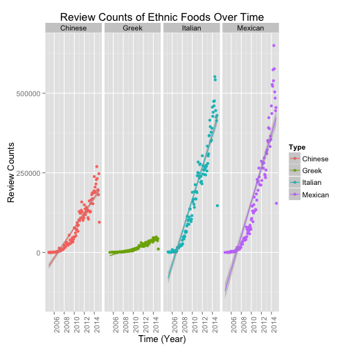

## Introduction
 * The Yelp datasets consist of many reviews from many businesses, many of which are restaurants. This analysis explores the performance of four ethnic restaurants - Chinese, Greek, Italian, and Mexican restaurants. The objective of this analysis is to explore the performance and review frequencies of these ethnic restaurants over time.
 
 * This analysis can be useful to both ethnic restaurant owners and Yelp users. For restaurant owners, the results presented in this report can help them understand the ratings and frequencies of reviews over time. In addition, it also provides information about the location of top performing ethnic restaurants.
 
 * As of the users, the information about the highest ranked cities can be most valuable to food enthusiasts.

--- 

## Method and Data
 * The data was processed by extracting and merging the following variables from the review and business datasets: "Review ID", "Stars", "Name", "State", "Categories", "City", "Review Counts", "Date", and "Business ID". 
 
 * The types of restaurant was explored by looking at the categories. From this, the cultural restaurants were determined: Chinese, Greek, Italian, and Mexican restaurants. 
 
 * The performance and review frequency of these restaurants, as well as the cities with the highest ranked restaurants, were determined. 

---

## Results

 

---

## Results

 

---

## Discussion

The above analysis provide useful information about the performance of four ethnic restaurants: Chinese, Greek, Italian, and Mexian restaurants. The months that have the most review for all four restaurants are July and August. For their preformance, Greek restaurants tend to perform better with respect to time, while the performances of the other resturants are decreasing with respect to time. Howevever, the review counts for Greek retaurants increased gradually in comparison to the other restaurants. In addition, it has the lowest number of review counts. As of the top 10 cities and states with the highest ranked restaurants, the ranking of the cities differ according to the types of restaurant. On the other hand, the city and state with the most ethnic restaurants (Chinese, Greek, Italian, and Mexican) are Las Vegas, Nevada.

